 

  

 

## 👋 About Me

I'm **Kaif Khan**, a final-year **B.Tech Computer Science** undergraduate at **KIET Group of Institutions**, graduating in **2027**. I'm passionate about solving algorithmic challenges and building scalable full-stack applications using the MERN stack. I enjoy turning complex problems into efficient, practical solutions while continuously improving my software engineering skills.

Currently, I'm focused on strengthening my backend development, database design, and system design fundamentals while maintaining a consistent practice routine in Data Structures & Algorithms. My goal is to graduate with a strong problem-solving mindset, production-ready development skills, and projects that demonstrate real-world software engineering principles.

- 🌱 Strengthening my backend development, databases, and system design skills
- 💻 Building full-stack applications with **React, Node.js, Express.js, MongoDB, and MySQL**
- 🧩 Practicing DSA regularly on **LeetCode, Codeforces, CodeChef, GeeksforGeeks**
- 🎯 Preparing for **Software Development Engineer (SDE)** internships and full-time opportunities
- 📍 Based in **Ghaziabad, Uttar Pradesh, India**

 

## 🎓 Education

| Qualification | Institution | Duration | Score |
|---|---|---|---|
| **B.Tech, Computer Science** | KIET Group of Institutions | 2023 – 2027 | CGPA: **8.68 / 10** |
| **Class XII (CBSE)** | Leelawati Public School | 2021-22 | 90.83% |
| **Class X (CBSE)** | Leelawati Public School | 2019-20 | 76.83% |

 

## 🛠️ Tech Stack

  

| Category | Stack |
|---|---|
| **Languages** | C, C++, Python, JavaScript, SQL |
| **Frontend** | HTML5, CSS3, React.js, Next.js, Tailwind CSS |
| **Backend** | Node.js, Express.js, REST APIs |
| **Databases** | MongoDB, MySQL |
| **Tools** | Git, GitHub, VS Code, Postman, Power BI |

 

## 🏆 Competitive Programming

<table>
<tr align="center">
<td>
<a href="https://leetcode.com/u/Dynamite05/">
 
<b>LeetCode</b>
</a>
</td>

<td>
<a href="https://codeforces.com/profile/kaif2828">
 
<b>Codeforces</b>
</a>
</td>

<td>
<a href="https://www.codechef.com/users/labor_art_09">
 
<b>CodeChef</b>
</a>
</td>

<td>
<a href="https://www.geeksforgeeks.org/profile/kaifkhan29g04">
 
<b>GeeksforGeeks</b>
</a>
</td>

<td>
<a href="https://www.naukri.com/code360/profile/Kaifkhan123">
 
<b>Code360</b>
</a>
</td>

<td>
<a href="https://www.hackerrank.com/profile/kaif_2327csit">
 
<b>HackerRank</b>
</a>
</td>

</tr>
</table>

### 💡 Areas of Interest

- 🧩 Data Structures & Algorithms
- 🌳 Trees & Graphs
- ⚡ Dynamic Programming
- 🎯 Greedy Algorithms
- 🔄 Recursion & Backtracking
- 🔢 Bit Manipulation
- 🧮 Number Theory

 

## 📜 Certifications

- ☁️ **Oracle Cloud Infrastructure AI Foundations Associate**
- 🗄️ **Database Management System – Part 1** *(Infosys Springboard)*
- 🗄️ **Database Management System – Part 2** *(Infosys Springboard)*
- 🛢️ **Oracle Database Programming with SQL**

 

## 🎯 Current Goals

- 🚀 Build production-ready MERN applications
- 🏗️ Strengthen backend development & system design
- 🧩 Solve advanced DSA problems consistently
- 💼 Prepare for Software Development Engineer (SDE) roles

 

## 📊 GitHub Stats

  

<!-- > **Note:** `github-readme-stats` moved to the actively maintained fork **[GitHub Stats Extended](https://github.com/stats-organization/github-stats-extended)** — the cards above use that domain for reliability. -->

 

## 📈 Activity Graph

 

## 💛 LeetCode Stats

 

## 📐 GitHub Metrics

<!-- > Generated automatically by [`metrics.yml`](.github/workflows/metrics.yml) using [`lowlighter/metrics`](https://github.com/lowlighter/metrics) — see the **Setup Notes** section below for the one-time secret you need to add. -->

 

<!-- ## 🏆 GitHub Trophies

  -->

## 🐍 Contribution Snake

<picture>
  <source media="(prefers-color-scheme: dark)" srcset="https://raw.githubusercontent.com/kaifcs/kaifcs/output/github-contribution-grid-snake-dark.svg" />
  <source media="(prefers-color-scheme: light)" srcset="https://raw.githubusercontent.com/kaifcs/kaifcs/output/github-contribution-grid-snake.svg" />
  
</picture>

<!-- > Generated automatically by [`snake.yml`](.github/workflows/snake.yml) using [`Platane/snk`](https://github.com/Platane/snk) — it will render blank until the workflow's first run (see below). -->

 

<!-- ## 📬 Connect With Me

<a href="mailto:kk.kaifkhan05@gmail.com">📧 Email</a> •
<a href="https://www.linkedin.com/in/kaif-khan-2805-2005-cs/">💼 LinkedIn</a> •
<a href="https://github.com/kaifcs">🐙 GitHub</a> •
<a href="https://leetcode.com/u/Dynamite05/">💻 LeetCode</a>

--- -->
